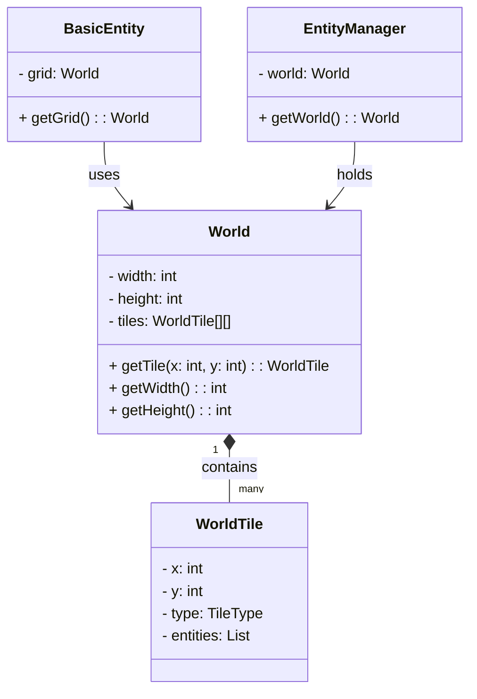
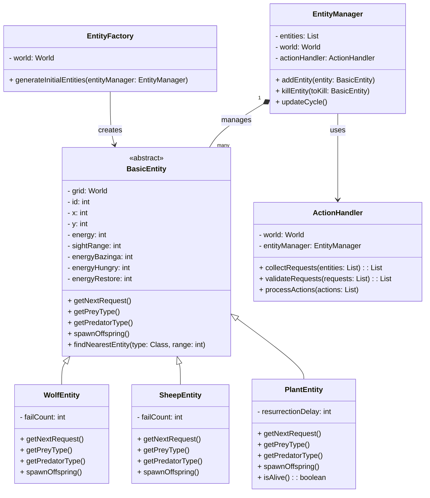
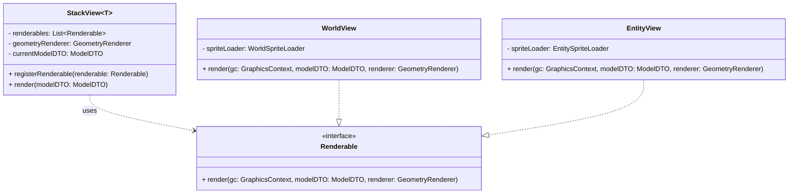
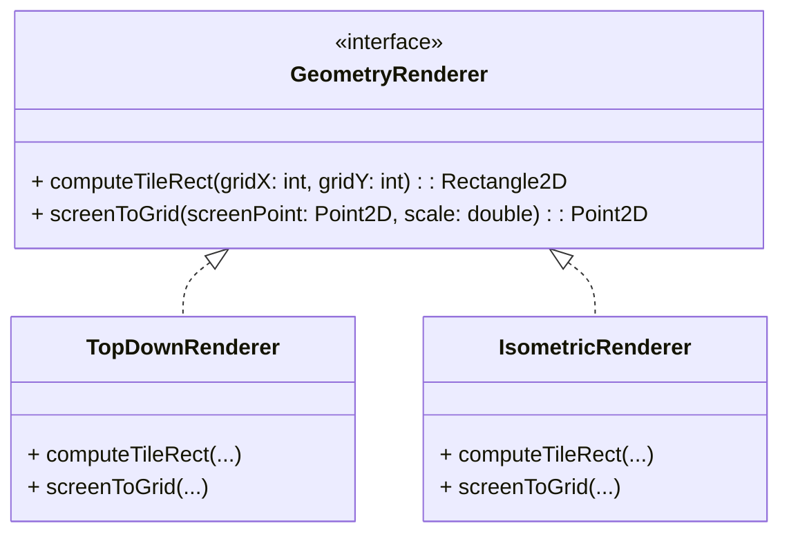
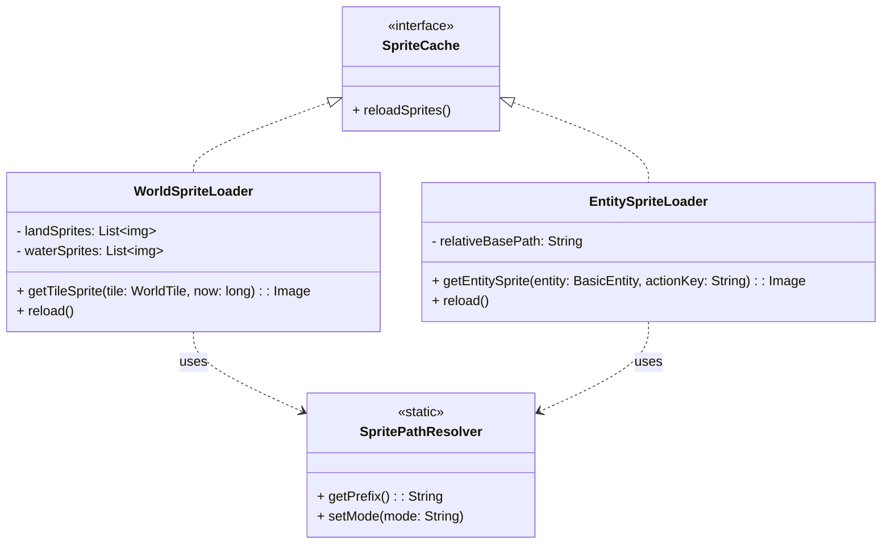
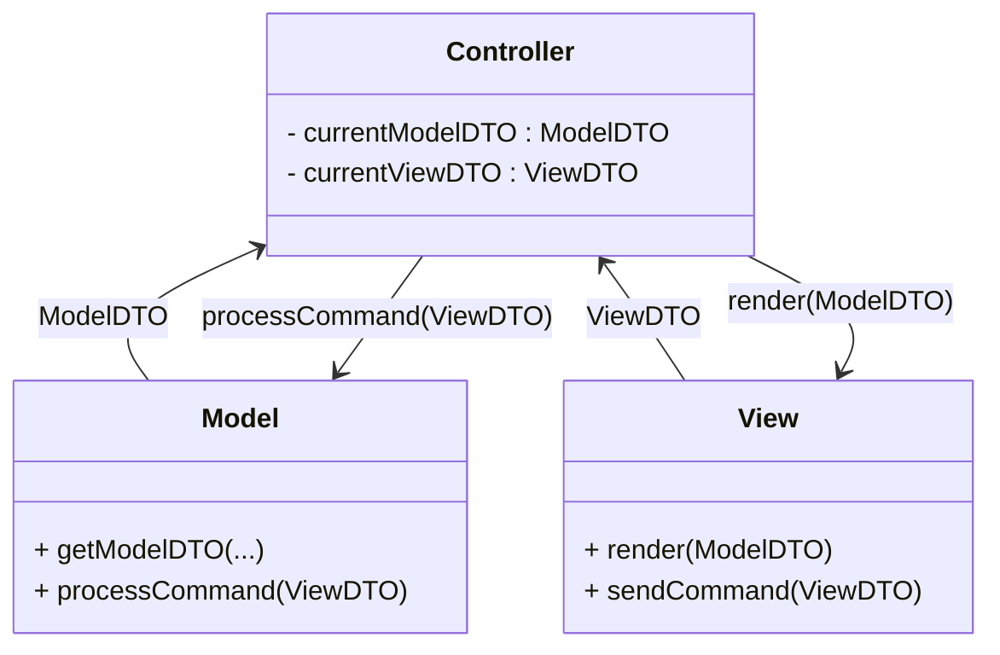

# Relazione di “Simulazione di un Ecosistema Naturale”

## Analisi dei Requisiti

Il gruppo si propone di realizzare un simulatore di un ecosistema naturale su un pianeta popolato da diverse creature organizzate in una catena alimentare (prede e predatori) le quali interagiscono con l’ambiente circostante e tra di loro. Queste interazioni includono procreazione, ricerca di cibo, inseguimento e fuga tra prede e predatori.

### Requisiti funzionali

- `[RF1]` Configurazione tramite interfaccia grafica con impostazioni persistenti tra le sessioni. Alcune impostazioni principali sono:
	- risoluzione della finestra, refresh rate
	- impostazioni di generazione del mondo
	- impostazioni delle entità
- `[RF2]` Comportamento indipendente delle singole creature con possibilità di espansione futura dell'ecosistema
- `[RF3]` Possibilità di scegliere tra varie modalità di visualizzazione, tra cui una prospettiva isometrica ([prendendo per esempio Diablo, Baldur's Gate o Warcraft](https://it.wikipedia.org/wiki/Videogioco_isometrico)).
- `[RF5]` Possibilità di regolare la velocità della simulazione indipendentemente dalle prestazioni grafiche del dispositivo

### Requisiti Opzionali

- Ereditarietà delle caratteristiche di ogni creatura nella progenie, in modo da simulare un sistema evolutivo
- Creature "pilotate" da un intelligenza artificiale, sfruttando l'[API di Gemini](https://ai.google.dev/gemini-api/docs)
- Interazione diretta dell’utente con le creature (catastrofi naturali, rimozione e aggiunta di creature, ...). [l'utente è una divinità](https://en.wikipedia.org/wiki/Pocket_God).

## Analisi e modello del dominio

### World
La classe `World` rappresenta una griglia composta da `Tile`. Un tile contiene un tipo (`LAND`, `WATER`, ...) e un array di entità. Può essere serializzato in un `ModelDTO`
(Data Transfer Object) che poi viene inviato a `View` tramite `Controller`.

#### Entity
Le entità derivano tutte da una `BasicEntity`che ne definisce i metodi principali, mentre alle classi figlio viene lasciata l'implementazione dei comportamenti specifici della creatura.
Ogni entità è una macchina a stati finiti che, tramite un metodo `getRequest()` richiede di compiere un azione a ogni ciclo di aggiornamento del `Model` all'`EntityManager`. 
Questo, sfruttando `ActionHandler` approva (o meno) le richieste e processa poi le azioni valide. In caso di negazioni consecutive delle richieste, un entità effettuerà un azione
speciale con lo scopo di cambiare stato.

### Views
La View principale è composta da alcuni elementi di controllo (contatori di entità, pulsanti per comandi, ...) e un viewport (`StackView`) che mostra una rappresentazione grafica
del `ModelDTO`. `StackView` può registrare diversi viewport (views) che renderizzano diverse parti del `ModelDTO` (`EntityView` si occuperà delle entità, `WorldView` del terreno, ...)
e vengono mostrati uno sopra l'altro come layer, centralizzando così nel layer principale i movimenti della telecamera, il culling e altre funzionalità.

### Geometry
I `GeometryRenderer` si occupano di definire come una determinata posizione nella griglia deve essere tradotta in coordinate a schermo (in pixel). Derivando da un interfaccia comune,
si può con facilità cambiare la modalità di visualizzazione (ad esempio da top-down a isometrico) a runtime, a patto che vengano forniti gli sprite necessari.

### Sprites
Ogni viewport si affida a una `SpriteCache` da cui attinge per decidere lo sprite adatto per rappresentare un determinato elemento. Mentre un viewport si occupa della posizione e
dimensione in cui questo deve essere mostrato, la logica che decide lo sprite corretto è affidata a una classe separata. Ad esempio, i tile `LAND` saranno inizializzati con uno tra una
serie di sprite disponibili, mentre quelli `WATER` seguiranno un animazione ciclica. Le creature invece avranno il loro sprite assegnato in base all'azione corrente e così via.

## Design
L'applicazione cerca di seguire strettamente l'architettura MVC (model - view - controller). L'obiettivo e quello di una completa separazione tra view e model, affidando
la comunicazione tra le due parti al controller, che funge da tramite. Questa avviene esclusivamente tramite dei DTO (Data Transfer Object) che contengono le informazioni strettamente
necessarie al funzionamento. Rispettivamente, sia `Model` che `View` instanziano due timer, e lavorano in maniera asincrona, essenzialmente come due programmi separati:
il model si occupa della simulazione e può essere modificato a runtime alla ricezione di un `ViewDTO`, mentre la view renderizza costantemente l'ultimo `ModelDTO` disponibile, che 
non deve necessariamente essere sincronizzato al refresh rate di quest'ultima. La ricezione dei DTO sfrutta il pattern dell'Observer.

## Design dettagliato
In questa sezione si possono approfondire alcuni elementi del design con maggior dettaglio. Mentre ci attendiamo principalmente (o solo) interfacce negli schemi UML delle sezioni precedenti, in questa sezione è necessario scendere in maggior dettaglio presentando la struttura di alcune sottoparti rilevanti dell'applicazione. È molto importante che, descrivendo la soluzione ad un problema, quando possibile si mostri che non si è re-inventata la ruota ma si è applicato un design pattern noto. Che si sia utilizzato (o riconosciuto) o meno un pattern noto, è comunque bene definire qual è il problema che si è affrontato, qual è la soluzione messa in campo, e quali motivazioni l'hanno spinta. È assolutamente inutile, ed è anzi controproducente, descrivere classe-per-classe (o peggio ancora metodo-per-metodo) com'è fatto il vostro software: è un livello di dettaglio proprio della documentazione dell'API (deducibile dalla Javadoc).
È necessario che ciascun membro del gruppo abbia una propria sezione di design dettagliato, di cui sarà il solo responsabile.
Ciascun autore dovrà spiegare in modo corretto e giustamente approfondito (non troppo in dettaglio, non superficialmente) il proprio contributo. È importante focalizzarsi sulle scelte che hanno un impatto positivo sul riuso, sull'estensibilità, e sulla chiarezza dell'applicazione. Esattamente come nessun ingegnere meccanico presenta un solo foglio con l'intero progetto di una vettura di Formula 1, ma molteplici fogli di progetto che mostrano a livelli di dettaglio differenti le varie parti della vettura e le modalità di connessione fra le parti, così ci aspettiamo che voi, futuri ingegneri informatici, ci presentiate prima una visione globale del progetto, e via via siate in grado di dettagliare le singole parti, scartando i componenti che non interessano quella in esame. Per continuare il parallelo con la vettura di Formula 1, se nei fogli di progetto che mostrano il design delle sospensioni anteriori appaiono pezzi che appartengono al volante o al turbo, c'è una chiara indicazione di qualche problema di design.
Si divida la sezione in sottosezioni, e per ogni aspetto di design che si vuole approfondire, si presenti:
: una breve descrizione in linguaggio naturale del problema che si vuole risolvere, se necessario ci si può aiutare con schemi o immagini;
: una descrizione della soluzione proposta, analizzando eventuali alternative che sono state prese in considerazione, e che descriva pro e contro della scelta fatta;
: uno schema UML che aiuti a comprendere la soluzione sopra descritta;
: se la soluzione è stata realizzata utilizzando uno o più pattern noti, si spieghi come questi sono reificati nel progetto (ad esempio: nel caso di Template Method, qual è il metodo template; nel caso di Strategy, quale interfaccia del progetto rappresenta la strategia, e quali sono le sue implementazioni; nel caso di Decorator, qual è la classe astratta che fa da Decorator e quali sono le sue implementazioni concrete; eccetera);
La presenza di pattern di progettazione correttamente utilizzati è valutata molto positivamente. L'uso inappropriato è invece valutato negativamente: a tal proposito, si raccomanda di porre particolare attenzione all'abuso di Singleton, che, se usato in modo inappropriato, è di fatto un anti-pattern.
Elementi positivi
Ogni membro del gruppo discute le proprie decisioni di progettazione, ed in particolare le azioni volte ad anticipare possibili cambiamenti futuri (ad esempio l'aggiunta di una nuova funzionalità, o il miglioramento di una esistente).
Si mostrano le principali interazioni fra le varie componenti che collaborano alla soluzione di un determinato problema.
Si identificano, utilizzano appropriatamente, e descrivono diversi design pattern.
Ogni membro del gruppo identifica i pattern utilizzati nella sua sottoparte.
Si mostrano gli aspetti di design più rilevanti dell'applicazione, mettendo in luce la maniera in cui si è costruita la soluzione ai problemi descritti nell'analisi.
Si tralasciano aspetti strettamente implementativi e quelli non rilevanti, non mostrandoli negli schemi UML (ad esempio, campi privati) e non descrivendoli.
Ciascun elemento di design identificato presenta una piccola descrizione del problema calato nell'applicazione, uno schema UML che ne mostra la concretizzazione nelle classi del progetto, ed una breve descrizione della motivazione per cui tale soluzione è stata scelta, specialmente se è stato utilizzato un pattern noto. Ad esempio, se si dichiara di aver usato Observer, è necessario specificare chi sia l'observable e chi l'observer; se si usa Template Method, è necessario indicare quale sia il metodo template; se si usa Strategy, è necessario identificare l'interfaccia che rappresenta la strategia; e via dicendo.
Elementi negativi
Il design del modello risulta scorrelato dal problema descritto in analisi.
Si tratta in modo prolisso, classe per classe, il software realizzato, o comunque si riduce la sezione ad un mero elenco di quanto fatto.
Non si presentano schemi UML esemplificativi.
Non si individuano design pattern, o si individuano in modo errato (si spaccia per design pattern qualcosa che non lo è).
Si utilizzano design pattern in modo inopportuno.
Si producono schemi UML caotici e difficili da leggere, che comprendono inutili elementi di dettaglio.
Si presentano schemi UML con classi (nel senso UML del termine) che "galleggiano" nello schema, non connesse, ossia senza relazioni con il resto degli elementi inseriti.
Si tratta in modo inutilmente prolisso la divisione in package, elencando ad esempio le classi una per una.
Testing automatizzato
Il testing automatizzato è un requisito di qualunque progetto software che si rispetti, e consente di verificare che non vi siano regressioni nelle funzionalità a fronte di aggiornamenti. Per quanto riguarda questo progetto è considerato sufficiente un test minimale, a patto che sia completamente automatico. Test che richiedono l'intervento da parte dell'utente sono considerati negativamente nel computo del punteggio finale.
Elementi positivi
Si descrivono molto brevemente i componenti che si è deciso di sottoporre a test automatizzato.
Si utilizzano suite specifiche (e.g. JUnit) per il testing automatico.
Elementi negativi 
Non si realizza alcun test automatico.
La non presenza di testing viene aggravata dall'adduzione di motivazioni non valide. Ad esempio, si scrive che l'interfaccia grafica non è testata automaticamente perché è impossibile farlo (testare in modo automatico le interfacce grafiche è possibile, si veda, come esempio, TestFX; semplicemente, nel corso non c'è modo e tempo di introdurvi questo livello di complessità).
Si descrive un testing di tipo manuale in maniera prolissa.
Si descrivono test effettuati manualmente che sarebbero potuti essere automatizzati, ad esempio scrivendo che si è usata l'applicazione manualmente.
Si descrivono test non presenti nei sorgenti del progetto.
I test, quando eseguiti, falliscono.
Note di sviluppo
Questa sezione, come quella riguardante il design dettagliato va svolta singolarmente da ogni membro del gruppo.
Ciascuno dovrà mettere in evidenza da un minimo di 3 ad un massimo di 5 punti in cui ritiene di aver scritto codice particolarmente ben congegnato, ad esempio perché sfrutta una libreria o feature avanzata non vista a lezione, oppure perché usa costrutti del linguaggio avanzati.
Ciascun elemento deve presentare:
Nome del sorgente dove reperirlo, a scelta uno fra:
nome qualificato della classe
percorso del file
permalink GitHub
Uno snippet con il codice cui ci si riferisce
Una brevissima descrizione della feature avanzata che si vuole mostrare.
Esempi di feature interessanti potrebbero essere:
Progettazione con generici, ad esempio costruzione di nuovi tipi generici, e uso di generici bounded.
Uso di lambda expressions
Uso di Stream, di Optional o di altri costrutti funzionali
Uso della reflection
Definizione ed uso di nuove annotazioni
Uso del Java Platform Module System
Uso di parti della libreria JDK non spiegate a lezione (networking, compressione, parsing XML, eccetera)
Uso di librerie di terze parti: JavaFX, Google Guava, Apache Commons...
Sviluppo di algoritmi particolarmente interessanti non forniti da alcuna libreria (spesso può convenirvi chiedere sul forum se ci sia una libreria per fare una certa cosa, prima di gettarvi a capofitto per scriverla voi stessi).
In questa sezione, dopo l'elenco, vanno menzionati ed attributi con precisione eventuali pezzi di codice "riadattati" (o scopiazzati...) da Internet o da altri progetti, pratica che tolleriamo ma che non raccomandiamo. Si rammenta agli studenti che non è consentito partire da progetti esistenti e procedere per modifiche successive. Si ricorda anche che i docenti hanno in mano strumenti antiplagio piuttosto raffinati e che "capiscono" il codice e la storia delle modifiche del progetto, per cui tecniche banali come cambiare nomi (di classi, metodi, campi, parametri, o variabili locali), aggiungere o togliere commenti, oppure riordinare i membri di una classe vengono individuate senza problemi. Le regole del progetto spiegano in dettaglio l'approccio dei docenti verso atti gravi come il plagiarismo.
I pattern di design non vanno messi qui. L'uso di pattern di design (come suggerisce il nome) è un aspetto avanzato di design, non di implementazione, e non va in questa sezione.
Elementi positivi
Ogni studente ha almeno 3 sottosezioni con snippet e descrizione
Nessuno studente ha più di 5 sottosezioni con snippet e descrizione
Si identificano parti di codice prese da altri progetti, dal web, o comunque scritte in forma originale da altre persone. In tal senso, si ricorda che agli ingegneri non è richiesto di re-inventare la ruota continuamente: se si cita debitamente la sorgente è tollerato fare uso di di snippet di codice open source per risolvere velocemente problemi non banali. Nel caso in cui si usino snippet di codice di qualità discutibile, oltre a menzionarne l'autore originale si invitano gli studenti ad adeguare tali parti di codice agli standard e allo stile del progetto. Contestualmente, si fa presente che è largamente meglio fare uso di una libreria che copiarsi pezzi di codice: qualora vi sia scelta (e tipicamente c'è), si preferisca la prima via.
Elementi negativi
Si elencano applicazioni di terze parti (peggio se per usarle occorre licenza, e lo studente ne è sprovvisto) che non c'entrano nulla con lo sviluppo, ad esempio:
Editor di grafica vettoriale come Inkscape o Adobe Illustrator;
Editor di grafica scalare come GIMP o Adobe Photoshop;
Editor di audio come Audacity;
Strumenti di design dell'interfaccia grafica come SceneBuilder: il codice è in ogni caso inteso come sviluppato da voi.
Si descrivono aspetti di scarsa rilevanza, o si scende in dettagli inutili.
Sono presenti parti di codice sviluppate originalmente da altri che non vengono debitamente segnalate. In tal senso, si ricorda agli studenti che i docenti hanno accesso a tutti i progetti degli anni passati, a Stack Overflow, ai principali blog di sviluppatori ed esperti Java, ai blog dedicati allo sviluppo di soluzioni e applicazioni (inclusi blog dedicati ad Android e allo sviluppo di videogame), nonché ai vari GitHub, GitLab, e Bitbucket. Conseguentemente, è molto conveniente citare una fonte ed usarla invece di tentare di spacciare per proprio il lavoro di altri.
Si elencano design pattern

## Commenti finali
Jacopo Spitaleri:

Alessandro Dominici:
Il progetto è stato molto divertente e stimolante da programmare, anche se purtroppo abbiamo dovuto tagliare molti obbiettivi forse troppo arroganti che ci eravamo posti inizialmente. Il lavoro è stato ben organizzato, avendo sempre lavorato a stretto contatto, o comunque in chiamata, non ci sono state problematiche sia interpersonali che a livello di codice. Java non mi era nuovo, e neanche la programmazione ad oggetti, dato che ho avuto la fortuna di iniziare ad utilizzare questo linguaggio alle superiori avendo fatto un itis, però con questo progetto ho avuto modo di ampliare enormemente le mie conoscenze di base, soprattutto nell’utilizzo dell’MVC. In generale posso dire che è stato abbastanza tedioso inizialmente il fare in modo di rendere completamente indipendenti queste tre parti del nostro codice, però poi fortunatamente con l’idea di implementare ii DTO è stato tutto molto più semplice. Anche la logica delle entità è stata particolarmente difficile, e abbiamo dovuto cancellare spesso tutto per ricominciare da capo nonostante le lunghe sessioni di analisi. Ma dopo diversi tentativi siamo riusciti a trovare una soluzione. Anche se penso si possa ancora migliorare ma sarà interessante porsi come obiettivo ampliare in futuro le entità presenti all’interno di questa simulazione per renderlo un mondo ancora più grande.

Seck Mactar Ibrahima:

In quest'ultimo capitolo si tirano le somme del lavoro svolto e si delineano eventuali sviluppi futuri.
Nessuna delle informazioni incluse in questo capitolo verrà utilizzata per formulare la valutazione finale, a meno che non sia assente o manchino delle sezioni obbligatorie. Al fine di evitare pregiudizi involontari, l'intero capitolo verrà letto dai docenti solo dopo aver formulato la valutazione.
Autovalutazione e lavori futuri
È richiesta una sezione per ciascun membro del gruppo, obbligatoriamente.
Ciascuno dovrà autovalutare il proprio lavoro, elencando i punti di forza e di debolezza in quanto prodotto. Si dovrà anche cercare di descrivere in modo quanto più obiettivo possibile il proprio ruolo all'interno del gruppo. Si ricorda, a tal proposito, che ciascuno studente è responsabile solo della propria sezione: non è un problema se ci sono opinioni contrastanti, a patto che rispecchino effettivamente l'opinione di chi le scrive.

## Guida utente
Nel menu iniziale è possibile impostare i valori standard di inizio della simulazione, come la quantità di prede e di predatori e la grandezza della griglia isometrica del mondo. In questo modo sarà l’utente a decidere le sorti iniziali della simulazione, una volta deciso tutto, premere il tasto “invio”.
L’utente può modificare le quantità di entità nel mondo in alto a sinistra.
L’utente può cambiare tramite il proprio tasto la modalità di visualizzazione del mondo, in alto a destra.

Capitolo in cui si spiega come utilizzare il software. Nel caso in cui il suo uso sia del tutto banale, tale capitolo può essere omesso. A tal riguardo, si fa presente agli studenti che i docenti non hanno mai utilizzato il software prima, per cui aspetti che sembrano del tutto banali a chi ha sviluppato l'applicazione possono non esserlo per chi la usa per la prima volta. Se, ad esempio, per cominciare una partita con un videogioco è necessario premere la barra spaziatrice, o il tasto "P", è necessario che gli studenti lo segnalino.
Elementi positivi
Si istruisce in modo semplice l'utente sull'uso dell'applicazione, eventualmente facendo uso di schermate e descrizioni.
Elementi negativi
Si descrivono in modo eccessivamente minuzioso tutte le caratteristiche, anche minori, del software in oggetto.
Manca una descrizione che consenta ad un utente qualunque di utilizzare almeno le funzionalità primarie dell'applicativo.

