# Relazione di “Simulazione di un Ecosistema Naturale”

## Analisi dei Requisiti

Il gruppo si propone di realizzare un simulatore di un ecosistema naturale su un pianeta popolato da diverse creature organizzate in una catena alimentare (prede e predatori) le quali interagiscono con l’ambiente circostante e tra di loro. Queste interazioni includono procreazione, ricerca di cibo, inseguimento e fuga tra prede e predatori.

### Requisiti funzionali

- `[RF1]` Configurazione tramite interfaccia grafica con impostazioni persistenti tra le sessioni. Alcune impostazioni principali sono:
	- risoluzione della finestra, refresh rate
	- impostazioni di generazione del mondo
	- impostazioni delle entità
- `[RF2]` Comportamento indipendente delle singole creature con possibilità di espansione futura dell'ecosistema
- `[RF3]` Possibilità di scegliere tra varie modalità di visualizzazione, tra cui una prospettiva isometrica ([prendendo per esempio Diablo, Baldur's Gate o Warcraft](https://it.wikipedia.org/wiki/Videogioco_isometrico)).
- `[RF5]` Possibilità di regolare la velocità della simulazione indipendentemente dalle prestazioni grafiche del dispositivo

### Requisiti Opzionali

- Ereditarietà delle caratteristiche di ogni creatura nella progenie, in modo da simulare un sistema evolutivo
- Creature "pilotate" da un intelligenza artificiale, sfruttando l'[API di Gemini](https://ai.google.dev/gemini-api/docs)
- Interazione diretta dell’utente con le creature (catastrofi naturali, rimozione e aggiunta di creature, ...). [l'utente è una divinità](https://en.wikipedia.org/wiki/Pocket_God).


## Analisi e modello del dominio

L'applicazione dovrà essere composta di due parti principali, model e view, le quali opereranno in maniera asincrona. Ciò permetterà all'utente di scegliere una velocità di simulazione a 
piacere indipendentemente dalle prestazioni grafiche della macchina. La comunicazione tra le due parti avverrà esclusivamente tramite il controller. Essenzialmente, View sarà un programma 
adibito al rendere graficamente un opportuno ModelDTO dato in input, mentre Model si occuperà di generare continuamente nuovi ModelDTO e rispondere ai comandi dati tramite ViewDTO.


## Design
L'applicazione cerca di seguire strettamente l'architettura MVC (model - view - controller). L'obiettivo e quello di una completa separazione tra view e model, affidando
la comunicazione tra le due parti al controller, che funge da tramite. Questa avviene esclusivamente tramite dei DTO (Data Transfer Object) che contengono le informazioni strettamente
necessarie al funzionamento. Rispettivamente, sia `Model` che `View` instanziano due timer, e lavorano in maniera asincrona, essenzialmente come due programmi separati:
il model si occupa della simulazione e può essere modificato a runtime alla ricezione di un `ViewDTO`, mentre la view renderizza costantemente l'ultimo `ModelDTO` disponibile, che 
non deve necessariamente essere sincronizzato al refresh rate di quest'ultima. La ricezione dei DTO sfrutta il pattern dell'Observer.


## Design dettagliato

### Seck

Implementazione delle entità, principalmente a livello di Model come macchine a stati finiti, sistema di richieste per EntityManager, integrazione con il ModelDTO, e contributo
nell'implementazione di EntitySpriteLoader e EntityView.

#### World
La classe `World` rappresenta una griglia composta da `Tile`. Un tile contiene un tipo (`LAND`, `WATER`, ...) e un array di entità. Può essere serializzato in un `ModelDTO`
(Data Transfer Object) che poi viene inviato a `View` tramite `Controller`.

```mermaid
classDiagram
    class World {
      - width: int
      - height: int
      - tiles: WorldTile[][]
      + getTile(x: int, y: int): WorldTile
      + getWidth(): int
      + getHeight(): int
    }
    
    class WorldTile {
      - x: int
      - y: int
      - type: TileType
      - entities: List<BasicEntity>
    }
    
    class BasicEntity {
      - grid: World
      + getGrid(): World
    }
    
    class EntityManager {
      - world: World
      + getWorld(): World
    }
    
    BasicEntity --> World : uses
    EntityManager --> World : holds
    World "1" *-- "many" WorldTile : contains

```



#### Entity
Le entità derivano tutte da una `BasicEntity`che ne definisce i metodi principali, mentre alle classi figlio viene lasciata l'implementazione dei comportamenti specifici della creatura.
Ogni entità è una macchina a stati finiti che, tramite un metodo `getRequest()` richiede di compiere un azione a ogni ciclo di aggiornamento del `Model` all'`EntityManager`. 
Questo, sfruttando `ActionHandler` approva (o meno) le richieste e processa poi le azioni valide. In caso di negazioni consecutive delle richieste, un entità effettuerà un azione
speciale con lo scopo di cambiare stato.


### Spitaleri

Implementazione della pipeline di rendering, compreso di sistemi di pan e zoom, culling, contributo nell'implementazione del ViewDTO.

#### Views
La View principale è composta da alcuni elementi di controllo (contatori di entità, pulsanti per comandi, ...) e un viewport (`StackView`) che mostra una rappresentazione grafica
del `ModelDTO`. `StackView` può registrare diversi viewport (views) che renderizzano diverse parti del `ModelDTO` (`EntityView` si occuperà delle entità, `WorldView` del terreno, ...)
e vengono mostrati uno sopra l'altro come layer, centralizzando così nel layer principale i movimenti della telecamera, il culling e altre funzionalità.


#### Geometry
I `GeometryRenderer` si occupano di definire come una determinata posizione nella griglia deve essere tradotta in coordinate a schermo (in pixel). Derivando da un interfaccia comune,
si può con facilità cambiare la modalità di visualizzazione (ad esempio da top-down a isometrico) a runtime, a patto che vengano forniti gli sprite necessari.


#### Sprites
Ogni viewport si affida a una `SpriteCache` da cui attinge per decidere lo sprite adatto per rappresentare un determinato elemento. Mentre un viewport si occupa della posizione e
dimensione in cui questo deve essere mostrato, la logica che decide lo sprite corretto è affidata a una classe separata. Ad esempio, i tile `LAND` saranno inizializzati con uno tra una
serie di sprite disponibili, mentre quelli `WATER` seguiranno un animazione ciclica. Le creature invece avranno il loro sprite assegnato in base all'azione corrente e così via.


### Dominici

Struttura principale del programma, gestione dell'architettura MVC, sistema di comunicazione asincrona tramite DTO, gestione centralizzata dei timer, configurazione dei parametri iniziali tramite menù esterno.

#### Controller

Il Controller funge da entry point effettivo (successivamente a `App` e `StartupMenu`), e si occupa di instanziare Model e View e gestirne la comunicazione. Si sfrutta l'Observer pattern per registrare
Controller come observer di entrambi. Riceve una notifica a ogni ciclo di aggiornamento del Model, e salva una copia del ModelDTO più recente in memoria, che verrà passata a View quando si aggiornerà.
Per quanto riguarda i comandi da parte di View, verrà notificato quando (tramite un input dell'utente) verrà pubblicato un nuovo ViewDTO contenente un comando, che poi processerà con azioni su Model.


#### Data Transfer Objects

I due DTO sono strutturati diversamente in quanto rispondono direttamente alle esigenze delle due parti: nel caso di ModelDTO si avrà una rappresentazione della griglia attuale, contenente, per ogni casella
il suo tipo e un array di entità che si trovano su tale casella. La priorità di rendering di ogni entità dipende dalla sua posizione nell'array, che viene ordinato secondo la loro tipologia. Il DTO della View, 
invece, contiene un elemento di tipo Command con i suoi argomenti. Nel caso di uno SpeedCommand verrà indicata la differenza di velocità da applicare, mentre nel caso di un TileClickCommand le coordinate della casella.


## Note di sviluppo

### Seck


```java
private static int createLake(World grid, int centerX, int centerY, int targetSize) {
	Queue<World.Tile> queue = new LinkedList<>();
	queue.add(grid.getTile(centerX, centerY));
	Set<World.Tile> lakeTiles = new HashSet<>();
	while (!queue.isEmpty() && lakeTiles.size() < targetSize) {
		
		World.Tile tile = queue.poll();
		if (tile == null || lakeTiles.contains(tile)) continue;
		
		setTile(grid, tile.getX(), tile.getY(), World.Tile.TileType.WATER);
		lakeTiles.add(tile);
		List<int[]> directions = List.of(new int[]{1, 0}, new int[]{-1, 0}, new int[]{0, 1}, new int[]{0, -1});
		
		directions.stream()
			.filter(dir -> random.nextDouble() < 0.8)
			.map(dir -> grid.getTile(tile.getX() + dir[0], tile.getY() + dir[1]))
			.forEach(queue::add);
	}
	return lakeTiles.size();
}
```
Qui viene usata l'espansione flood-fill (anche detta seed fill) per la generazione dei laghi sul terreno
- https://en.wikipedia.org/wiki/Flood_fill
- https://www.geeksforgeeks.org/flood-fill-algorithm/


```java
private static int createLake(World grid, int centerX, int centerY, int targetSize) {
		Queue<World.Tile> queue = new LinkedList<>();
		queue.add(grid.getTile(centerX, centerY));
		Set<World.Tile> lakeTiles = new HashSet<>();
		while (!queue.isEmpty() && lakeTiles.size() < targetSize) {
			
			World.Tile tile = queue.poll();
			if (tile == null || lakeTiles.contains(tile)) continue;
			
			setTile(grid, tile.getX(), tile.getY(), World.Tile.TileType.WATER);
			lakeTiles.add(tile);
			List<int[]> directions = List.of(new int[]{1, 0}, new int[]{-1, 0}, new int[]{0, 1}, new int[]{0, -1});
			
			directions.stream()
				.filter(dir -> random.nextDouble() < 0.8)
				.map(dir -> grid.getTile(tile.getX() + dir[0], tile.getY() + dir[1]))
				.forEach(queue::add);
		}
		return lakeTiles.size();
	}
```
Qui viene usato un semplice algoritmo di pathfinding per collegare tra loro i laghi con dei fiumi non perfettamente dritti


```java
protected BasicEntity findNearestEntity(Class<? extends BasicEntity> type, int range) {
	if (type == null) {
		return null;
	}
	BasicEntity nearest = null;
	int minDist = Integer.MAX_VALUE;
	for (int dx = -range; dx <= range; dx++) {
		for (int dy = -range; dy <= range; dy++) {
			
			int nx = x + dx, ny = y + dy;
			World.Tile tile = grid.getTile(nx, ny);
			
			if (tile == null) { continue; }

			for (BasicEntity other : tile.getEntities()) {
				if (other == this || !type.isInstance(other) || !other.isAlive()) { continue; }
				int dist = Math.abs(dx) + Math.abs(dy);

				if (dist < minDist) { minDist = dist; nearest = other; }
			}
		}
	}
	return nearest;
}
```
Qui viene utilizzato un algoritmo di Manhattan distance per trovare l'entità più vicina di un tipo dato.
- https://cp-algorithms.com/geometry/manhattan-distance.html
- https://www.geeksforgeeks.org/calculate-the-manhattan-distance-between-two-cells-of-given-2d-array/

### Dominici


```java
public String toActionString(BasicEntity self, Function<Integer, BasicEntity> entityLookup) {
	if (type == ActionType.MOVE) {
		if (direction == null) { return "IDLE"; }
		return "MOVE_" + direction.name();

		} else if (type == ActionType.INTERACT) {
			BasicEntity target = entityLookup.apply(targetId);
			if (target == null || !target.isAlive()) { return "IDLE"; }
			if (self.getPreyType() != null && self.getPreyType().isInstance(target)) { return "EAT"; }
			if (self.getClass().equals(target.getClass()) && self.getEnergy() >= self.getEnergyBazinga() && !self.hasBazinged && !target.hasBazinged()) { return "BAZINGA"; }

			return "IDLE";
		}
		return "IDLE";
	}
}
```
Qui viene convertita la richiesta di un entità (MOVE_UP, MOVE_LEFT, ... , INTERACT(TARGET)) in una stringa più espressiva, sulla base del target dell'azione. La funzione viene sfruttata per la scelta degli sprite.


```java
private void updateCounters(ModelDTO modelDTO) {
	new Thread(() -> {
		int plants = 0;
		int sheep = 0;
		int wolves = 0;

		for (int x = 0; x < modelDTO.getGrid().getWidth(); x++) {
			for (int y = 0; y < modelDTO.getGrid().getHeight(); y++) {
				for (BasicEntity entity : modelDTO.getGrid().getTile(x, y).getEntities()) {
					if (!entity.isAlive()) continue;
					if (entity instanceof PlantEntity) { plants++; } 
					else if (entity instanceof SheepEntity) { sheep++; }
					else if (entity instanceof WolfEntity) { wolves++; }
				}
			}
		}
		final int finalPlants = plants;
		final int finalSheep = sheep;
		final int finalWolves = wolves;
		Platform.runLater(() -> {
			plantCounter.setText("plant: " + finalPlants);
			sheepCounter.setText("sheep: " + finalSheep);
			wolfCounter.setText("wolf: " + finalWolves);
		});
	}).start();
}
```

I contatori delle entità nella barra di controllo della View vengono aggiornati in maniera asincrona rispetto al resto del programma.
- https://www.w3schools.com/java/java_threads.asp
- https://docs.oracle.com/javase/8/docs/api/java/lang/Thread.html


```java
private void attachMouseHandler() {
	viewport.setOnMouseClicked(e -> {
		if (modelDTO == null) return;
		Point2D localPoint = viewport.sceneToLocal(e.getSceneX(), e.getSceneY());
		double scale = viewport.getCamera().getScale();
		Point2D cameraOffset = CameraOffsetHandler.computeCameraOffset(viewport.getGeometryRenderer(), viewport.getCamera(), viewport.getWidth(), viewport.getHeight(), modelDTO.getGrid().getWidth(), modelDTO.getGrid().getHeight());
		Point2D gridCoords = viewport.getGeometryRenderer().screenToGrid(localPoint, scale, cameraOffset);
		int tileX = (int) gridCoords.getX();
		int tileY = (int) gridCoords.getY();

		if (tileX >= 0 && tileY >= 0 && tileX < modelDTO.getGrid().getWidth() && tileY < modelDTO.getGrid().getHeight()) {
			worldView.setHighlightedTile(tileX, tileY);
			viewObserver.onViewAction(new ViewDTO(new ViewDTO.EntityTileClickCommand(tileX, tileY)));
		}
	});
}
```

L'Handler del mouse si occupa di gestire i click del mouse, mandando un DTO al click di un tile e chiamando il metodo di highlight del tile in WorldView.

### Spitaleri

## Commenti finali
### Spitaleri
Ho provato in ogni modo a evitare di implementare il culling ma alla fine non avere i soldi per una nuova GPU mi ha costretto a imparare qualcosa di nuovo. Credo che il modo in cui la parte di grafica si separa dalla parte di simulazione sia interessante, un programma che si occupa esclusivamente della simulazione e un altro che renderizza input arbitrari che rispettano un determinato formato. In particolare è stato impegnativo trovare una soluzione al problema di applicare le trasformazioni del mouse a tutti i layer in modo uniforme: inizialmente si parlava semplicemente di scalare e muovere un immagine ma quando la pipeline ha iniziato a diventare più complessa è stata fondamentale l'idea di estendere la classe Canvas per creare StackView. Ci sono diverse cose che mi piacerebbe implementare e che rimarrano un sogno nel mio git stash per ora, come un vero e proprio z-index per rendere il tutto effettivamente tridimensionale e . Spero anche che nessuno guardi troppo da vicino le pecore perchè sono davvero brutte, o i lupi, perchè in realtà sono draghi.

### Dominici
Il progetto è stato molto divertente e stimolante da programmare, anche se purtroppo abbiamo dovuto tagliare molti obbiettivi forse troppo arroganti che ci eravamo posti inizialmente. Il lavoro è stato ben organizzato, avendo sempre lavorato a stretto contatto, o comunque in chiamata, non ci sono state problematiche sia interpersonali che a livello di codice. Java non mi era nuovo, e neanche la programmazione ad oggetti, dato che ho avuto la fortuna di iniziare ad utilizzare questo linguaggio alle superiori avendo fatto un itis, però con questo progetto ho avuto modo di ampliare enormemente le mie conoscenze di base, soprattutto nell’utilizzo dell’MVC. In generale posso dire che è stato abbastanza tedioso inizialmente il fare in modo di rendere completamente indipendenti queste tre parti del nostro codice, però poi fortunatamente con l’idea di implementare ii DTO è stato tutto molto più semplice. Anche la logica delle entità è stata particolarmente difficile, e abbiamo dovuto cancellare spesso tutto per ricominciare da capo nonostante le lunghe sessioni di analisi. Ma dopo diversi tentativi siamo riusciti a trovare una soluzione. Anche se penso si possa ancora migliorare ma sarà interessante porsi come obiettivo ampliare in futuro le entità presenti all’interno di questa simulazione per renderlo un mondo ancora più grande.

### Seck
Questa esperienza è stata molto interessante e formativa, L’idea del progetto ha reso lo sviluppo ancora più avvincente e coinvolgente, mi ha permesso di scoprire in maniera più approfondita e realistica le varie dinamiche e fasi di gestione di un progetto, con particolare attenzione al lavoro di gruppo e come gestire imprevisti disaccordi e problematiche che si possono verificare durante quest’ultimo. Avendo alle superiori affrontato (con linguaggio C#) la programmazione a oggetti mi ha permesso di partire con conoscenze iniziali di base su come affrontare la gestione delle entità di come si relazionano tra loro e in generale l’architettura dei vari elementi principali che costituiscono il progetto, unendo poi il tutto con lo conoscenze approfondite durante il corso.
I vari tentativi di sviluppo e implementazione mi hanno portato a decidere di utilizzare un approccio per la gestione delle varie entità seguendo lo schema delle macchine a stati finiti, il quale mi è sembrato appropriato per questo progetto.
Alla fine il risultato finale mi ha soddisfatto molto, nonostante l'idea iniziale abbia subito un'evoluzione significativa, portando a un risultato finale molto diverso da quello che avevo immaginato all'inizio, in futuro mi piacerebbe aggiornarlo, magari con altre creature e funzionalità.
Ovviamente ci sono stati alcuni problemini ma con il lavoro di gruppo siamo riusciti a superarli, oltre a imparare dai compagni altri punti di vista e tecniche diverse

## Guida utente
Nel menu iniziale è possibile impostare i valori standard di inizio della simulazione, come la quantità di prede e di predatori e la grandezza della griglia isometrica del mondo. In questo modo sarà l’utente a decidere le sorti iniziali della simulazione, una volta deciso tutto, premere il tasto “è ora di giocare”.

### Barra di controllo
- I tasti `+` e `-` modificano la velocità della simulazione.
- Il tasto `Toggle View` cambia la modalità di visualizzazione della griglia
- Cliccare su una casella riporta il suo stato corrente nella barra di controllo. Lo stato di un entità viene riportato come `entità ID (energia): azione`

### Comandi mouse
Se si utilizza un trackpad:
- utilizzare due dita per muovere la visuale (sia verticalmente che orizzontalmente)
- tenere premuto `Ctrl` e muovere con due dita per modificare lo zoom

Se si utilizza un mouse:
- utilizzare la rotellina del mouse per muovere la visuale verticalmente
- tenere premuta la rotellina del mouse per trascinare la visuale in qualsiasi direzione
- tenere premuto `Shift` e usare la rotellina del mouse per muovere la visuale orizzontalmente
- tenere premuto `Ctrl` e usare la rotellina del mouse per modificare lo zoom 


